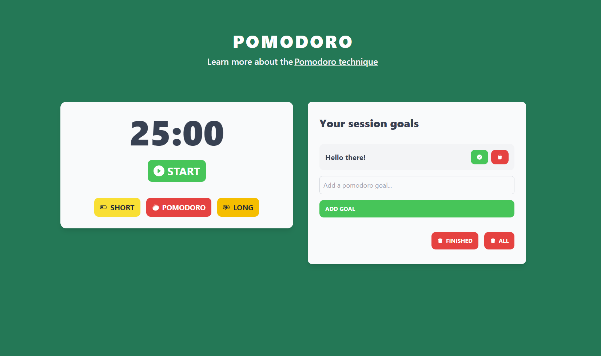

# React Pomodoro timer

## [Live demo](https://rad-hummingbird-8aba8c.netlify.app/)

### This project utilises the Pomodoro technique to help you focus on a task for a set amount of time.

#### The Pomodoro technique is a time management method that uses a timer to break down work into intervals, traditionally 25 minutes in length, separated by short breaks (in this case 5 and 15). Each interval is known as a pomodoro, from the Italian word for 'tomato', after the tomato-shaped kitchen timer that Cirillo used as a university student.

## Technologies used:

* Typescript
* React
* React hooks
